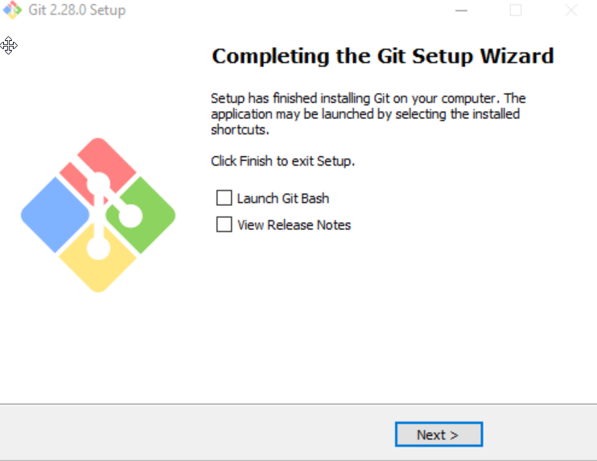

# BACKEND API
Servicios web para resolver práctica sobre exchange y blockchain

## Tabla de contenidos
- [Prerrequisitos](#prerrequisitos)
    - [Java, JDK 11](#java-jdk-11)
    - [Apache Maven](#apache-maven)
    - [Git](#git)
- [Instalación](#instalacin-del-proyecto-backend-api)
    - [Descarga](#descarga)
    - [Ejecución](#ejecucin)

## Prerrequisitos
### Java, JDK 11
- Verificar si ya se tiene una versión instalada ejecutando el siguiente comando en la terminal:
```bash
java -version
```
Si el comando devuelve
```bash
"java" no se reconoce como un comando interno o externo, programa o archivo por lotes ejecutable.
```
quiere decir que no se tiene instalado el jdk.

Si muestra que se tiene una versión distinta a “11.x.x” se necesita instalar la versión correcta.

Si muestra que se tiene una versión “11.x.x”, se tiene el jdk correcto instalado y configurado:
    

- Si no se tiene instalada la versión correcta o ninguna, se procede a descargar e instalar el JDK 11:
  - Acceder al enlace [https://www.oracle.com/java/technologies/javase-jdk11-downloads.html](https://www.oracle.com/java/technologies/javase-jdk11-downloads.html).
  - Elegir la versión de acuerdo al Sistema Operativo, descargar e instalar (recordar la ruta de instalación):
  
    
    
    

- Una vez finalizada la instalación, se necesitan configurar las variables de entorno del sistema:
  - Escribir “variables de entorno” en el buscador de Windows y seleccionar “Editar las variables de entorno del sistema”:
  
    
  - Dar click en “Variables de entorno”:
  - En el apartado de "Variables del sistema" seleccionar “Nueva”:
  
    
  - Crear una nueva variable de nombre JAVA_HOME y la ruta de instalación del JDK como valor (ej. C:\Program Files\Java\jdk-11.0.8) y clickear aceptar:
  
    
  - Regresar al apartado “Variables del sistema”, buscar la variable llamada “Path” y dar doble click:
  
    
  - Seleccionar "Nuevo":
  
    
  - Escribir %JAVA_HOME%\bin y seleccionar aceptar:
  
    
  - En las ventanas “Variables de entorno” y “Propiedades del sistema” también seleccionar Aceptar.
  - Para comprobar la configuración, abrir una nueva terminal y escribir java -version:
```bash
java -version
```
 Debe mostrar un texto como el de la imagen, indicando la versión 11.x.x: 
    


### Apache Maven
- Verificar si ya se tiene una versión instalada ejecutando el siguiente comando en la terminal:
```bash
mvn --version
```
Si el comando devuelve
```bash
"mvn" no se reconoce como un comando interno o externo, programa o archivo por lotes ejecutable.
```
quiere decir que no se tiene instalado Apache Maven.

Si el comando indica la versión, se tiene Apache Maven instalado y configurado correctamente.
    
- Si no se tiene instalado Maven, se procede a descargarlo:
  - Acceder al enlace [https://maven.apache.org/download.cgi](https://maven.apache.org/download.cgi).
  - Descargar el archivo “Binary zip archive”:
  
    
  - Extraer el zip en un directorio, se recomienda C:\Users\\<User> (recordar la ruta).

- Una vez realizada la extracción del .zip, se necesitan configurar las variables de entorno del sistema:
  - Escribir “variables de entorno” en el buscador de Windows y seleccionar “Editar las variables de entorno del sistema”:

    
  - Dar click en “Variables de entorno”:
  - En el apartado de "Variables del sistema" seleccionar “Nueva”:
    
    
  - Crear una nueva variable de nombre MAVEN_HOME y la ruta de Apache Maven (ej. C:\Users\\<User>\apache-maven-3.6.3) y clickear aceptar:
  
    
  - Regresar al apartado “Variables del sistema”, buscar la variable llamada “Path” y dar doble click:
    
    
  - Seleccionar "Nuevo":
  
    
  - Escribir %MAVEN_HOME%\bin y seleccionar aceptar:
  
    
  - En las ventanas “Variables de entorno” y “Propiedades del sistema” también seleccionar Aceptar.
  - Para comprobar la configuración, abrir una nueva terminal y escribir mvn --version:
```bash
mvn --version
```
 Debe mostrar un texto como el de la imagen, indicando la versión que se haya instalado.
    

## Git
- Verificar si ya se tiene una versión instalada ejecutando el siguiente comando en la terminal:
```bash
git --version
```
Si el comando devuelve
```bash
"git" no se reconoce como un comando interno o externo, programa o archivo por lotes ejecutable.
```
quiere decir que no se tiene instalado Git.

Si el comando indica la versión, se tiene Git instalado y configurado correctamente.
    
- Si no se tiene instalado Git, se procede a descargarlo:
  - Acceder al enlace [https://git-scm.com/downloads](https://git-scm.com/downloads).
  - Descargar de acuerdo al SO.
  
  
  - Ejecutar el instalador y seguir la configuración recomendad por el asistente.
  
      
      
- Para comprobar la configuración, abrir una nueva terminal y escribir git --version:
```bash
git --version
```
 Debe mostrar un texto como el de la imagen, indicando la versión que se haya instalado.
    

# Instalación del proyecto backend-api
*Estos pasos solo son necesarios si no se tiene descargado el proyecto.

## Descarga
- Crear una carpeta donde se alojará el proyecto (Ej. C:\Users\<User>\\Documents\Nebular\challenges).
- Desde una terminal, abrir la carpeta con el comando cd <directorio>, ejemplo:
```bash
cd C:\Users\<User>\Documents\Nebular\challenges
```
- Clonar el repositorio con el comando:
```bash
git clone https://github.com/PuzzlegoldSL/blockchain-challenge.git
```
.
    
## Ejecución
- Cuando se haya clonado el proyecto, ingresar a la ruta con el comando cd <directorio>\blockchain-challenge\backend-api, ejemplo:
```bash
cd C:\Users\<User>\Documents\Nebular\challenges\blockchain-challenge\backend-api
```
- Una vez en el directorio, arrancar el proyecto ejecutando el comando:
```bash
mvn spring-boot:run
```
.
    
- Cuando en la terminal se muestre el texto señalado en los recuadros, el proyecto está en línea y funcionando:
    
    