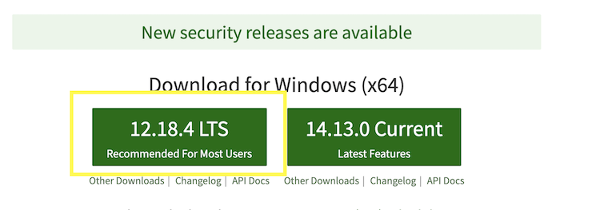
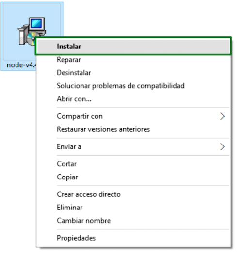
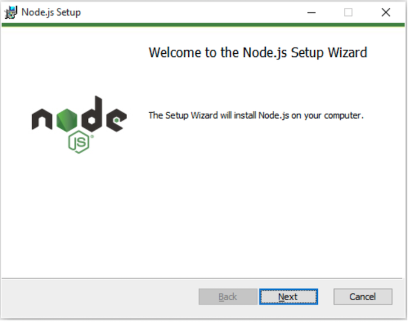

# Nebular Blockchain Challenge 
Ejercicios y practicas sobre exchange y blockchain

## Tabla de Contenido

- [Nebular Blockchain Challenge Web Portal](#Nebular)
    - [Prerequisitos](#prerequisitos)
        - [Node.js](#nodejs)
        - [Angular CLI](#angular-cli)
  - [Instalacion](#installation)
    - [Descargar proyecto](#descargar-proyecto)
  - [Ejecucion local](#ejecucion-local)
  - [Detener servidor](#detener-servidor)

#### Prerequisitos
El portal esta construido con Angular 9, por tanto es importante, previo a ejecutar el portal web, 
se debe tener instalado `Node.js®` y `npm` que es el administrador de paquetes.

Para poder descargar el proyecto se requiere tener instalado Git [git-scm.com](https://git-scm.com/).
En caso de requerir instalación consultar la documentacion que se encuentra en [BackendApiDocs](https://github.com/PuzzlegoldSL/blockchain-challenge/tree/master/backend-api) 


###### Node.js
Angular 9 require `Node.js` version 10.13 or superior.

- Para obtener `Node.js`, visita el sitio [nodejs.org](https://nodejs.org/).
- Descargar el instalador para windows
    
- Ejecutar haciendo doble clic o un clic derecho sobre el archivo descargado y seguir las instrucciones del instalador.
    
    
- Para verificar la version, ejecutar `node -v` en una terminal o consola.

###### Angular CLI
Se debe instalar Angular CLI globalmente utilizando una terminal o consola.
```bash
npm install -g @angular/cli
```
Verificar que la instalacion fue correcta:
```bash
ng version
```

## Instalacion

### Descargar proyecto

``` bash
# Descargar del repositorio
$ git clone https://github.com/PuzzlegoldSL/blockchain-challenge.git

# Cambiar al directorio del portal web
$ cd web-portal

# instalar las dependencias (librerias)
$ npm install
```

## Ejecucion local
Una vez descargado el proyecto e instalado las dependencias exitosamente, procedmos a ejecutar
el servidor local para poder acceder al portal en [localserver](http://localhost:4200/).
``` bash
# Servidor local con hot reload (carga automatica) en url http://localhost:4200.
$ ng serve
```

## Detener servidor
``` bash
# Desde terminal o consola usar la combinación de tec
$ Ctrl-c

# Confirmar acción
$ y + Enter
```
